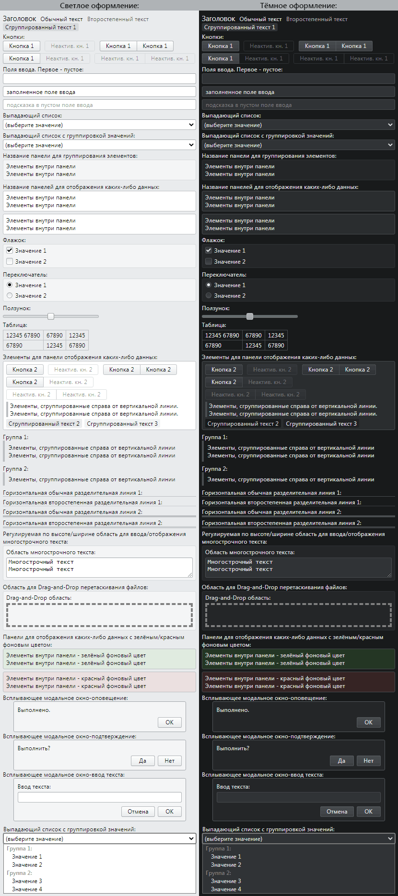
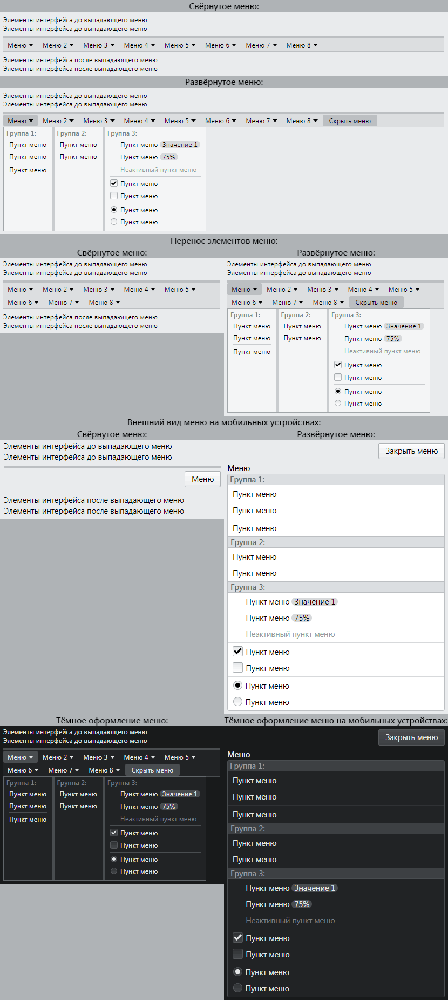
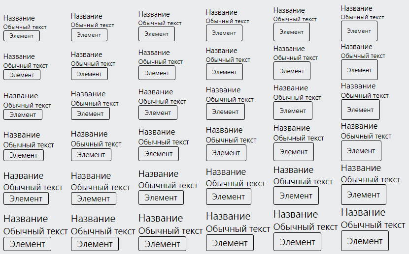

# Содержание

- [Даты изменения](#Даты-изменения)
- [Тип репозитория](#Тип-репозитория)
- [Информация о проекте](#Информация-о-проекте)
  - [Основная информация](#Основная-информация)
  - [Применённые технологии](#Применённые-технологии)
- [Скриншоты](#Скриншоты)
  - [Все элементы интерфейса, кроме меню](#Все-элементы-интерфейса-кроме-меню)
  - [Меню](#Меню)
  - [Настройки элементов интерфейса](#Настройки-элементов-интерфейса)

---

# Даты изменения

[⬆](#Содержание)

| Действие                           | Дата                |
|------------------------------------|--------------------:|
| Информация о проекте была изменена | 27.09.2022          |
| Скриншоты были сделаны             | 27.09.2022          |
| Работа над проектом началась       | примерно 07.01.2022 |

---

# Тип репозитория

[⬆](#Содержание)

Это не проект с открытым исходным кодом. Это портфолио в виде информации о проекте (со скриншотами результата работы над проектом).

---

# Информация о проекте

## Основная информация

[⬆](#Содержание)

Это элементы интерфейса, которые я использую для оформления web-страниц своих проектов.

---

## Применённые технологии

[⬆](#Содержание)

- HTML (своя вёрстка)
- CSS (свои стили)
- JavaScript (без фреймворков)

---

# Скриншоты

## Все элементы интерфейса, кроме меню

[⬆](#Содержание)

В первую очередь данные элементы интерфейса предназначены для мобильных устройств (этот вариант показан на скриншоте), но также хорошо выглядят на обычных устройствах (ширина в 2 раза больше относительно того, что показано на скриншоте).

Данные элементы интерфейса содержат:
- Стилизованные стандартные элементы интерфейса браузера;
- Новые элементы интерфейса, которых нет среди стандартных элементов интерфейса браузера.

---

## Меню

[⬆](#Содержание)

У меню 2 разных вида: для обычных устройств и для мобильных устройств. Вид меню зависит от ширины экрана.

---

## Настройки элементов интерфейса

[⬆](#Содержание)

К данным элементам интерфейса можно применить следующие настройки:
- Светлое\тёмное оформление (уже было показано на скриншотах выше).
- Скруглённые\острые углы элементов.
- Размер шрифта.
- Высота элементов (чем больше, тем удобнее для сенсорных экранов).

Варианты настроек "размер шрифта" (по вертикали) и "высота элементов" (по горизонтали):

---

[⬆](#Содержание)
